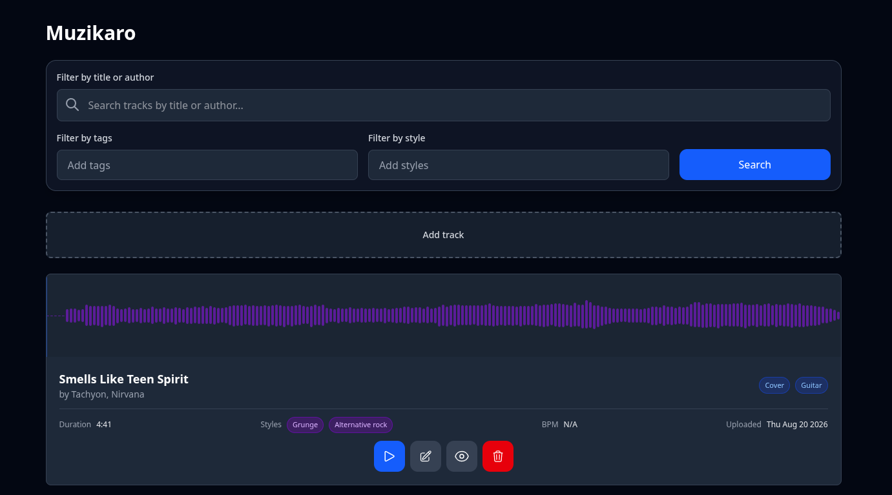
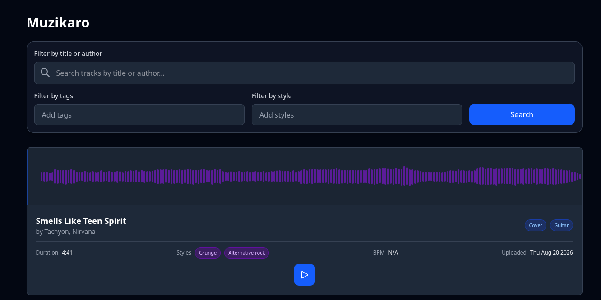

# Muzikaro

A lightweight, self-hosted music portfolio built with SvelteKit and tailwindCSS.

<table>
  <tr>
    <td align="center" width="50%">
      <strong>Admin interface to Muzikaro</strong>
    </td>
    <td align="center" width="50%">
      <strong>Visitor interface to Muzikaro</strong>
    </td>
  </tr>
  <tr>
    <td align="center" width="50%">
      
    </td>
    <td align="center" width="50%">
      
    </td>
  </tr>
</table>

## General information

This website is a lightweight self-hosted alternative to soundcloud and serves as a portfolio. It has the following features:
* Interface to add / remove / update music
* Metadata handling such as:
  * Time of upload
  * Title
  * Authors
  * BPM
  * Styles
  * Setup
  * Description
  * Tags
* A waveform interface provided by waveform.js
* Search and filtering by title, author, tag and music style
* A tagging system

## Tech stack

* [SvelteKit](https://svelte.dev/)
* [Better auth](https://better-auth.com/docs/installation) with [SvelteKit](https://better-auth.com/docs/integrations/svelte-kit)
* [TailwindCSS](https://tailwindcss.com/) for the design
* [Drizzle ORM](https://svelte.dev/docs/cli/drizzle) + SQLite for the database
* [WaveSurfer.js](https://wavesurfer.xyz/) (for the waveform of the sound)


## Installation

### Requirements

The app requires NodeJS, pnpm and ffprobe:

- [NodeJS](https://nodejs.org/en/download)
- [pnpm](https://pnpm.io/installation)
- [ffprobe (ffmpeg)](https://ffmpeg.org/download.html)

### Setup

In order to install and run the project and set up a [GitHub app](https://docs.github.com/en/apps/creating-github-apps/about-creating-github-apps/about-creating-github-apps):

```bash
git clone https://github.com/Kim-Vallee/Muzikaro.git
cd Muzikaro
pnpm install
cp .env.example .env
```

Configure the `.env` file accordingly (see [Environment variables](#environment-variables)) and:

```bash
pnpm run dev
```

### Environment variables

| Variable | Description | Required |
|---|---|---|
| `BETTER_AUTH_SECRET` | Secret used by Better Auth | Yes |
| `BETTER_AUTH_URL` | Public URL of the application used for the GitHub app | Yes |
| `DATABASE_URL` | URL of the database (e.g. `database.db`) | Yes |
| `CLIENT_ID_GITHUB` | Client ID of the GitHub app | Yes |
| `CLIENT_SECRET_GITHUB` | Client secret of the Github app | Yes |
| `AUDIO_DIR` | Absolute path to your audio files | Yes |
| `PRODUCTION_HOST` | The host IP in production | Production only |
| `PRODUCTION_PORT` | The port to use in production | Production only |
| `PRODUCTION_ORIGIN` | Your website URL, likely the same as `BETTER_AUTH_URL` | Production only |

The `BETTER_AUTH_SECRET` variable can be generated with the command `openssl rand -base64 32`.

## Contribution and dev

### Guidelines

Contributions are welcome. Please open an issue before implementing
substantial changes.

1. Fork the repository
2. Create a branch
3. Make your changes
4. Run the tests/checks (no test implemented in v0.1.0)
5. Open a pull request

### Handling the database

The database schema are found in `src/lib/server/db/schema.ts` and once updated, the procedure to generate migrations is:
1. `pnpm run db:generate` to generate the migration files
2. `pnpm run db:migrate` to migrate to apply the migration

A fast forward, but not recommended option is to use `pnpm run db:push` which ignores the previously mentioned commands and directly applies the update, only useful in dev mode.

The general methods to access the db are in `src/lib/server/db/music.ts`.

### Testing

Testing is done with [Vitest](https://svelte.dev/docs/svelte/testing). You can run the tests with:

```bash
pnpm run test
```

### Deploy

The standard procedure to deploy uses [adapter-node](https://svelte.dev/docs/kit/adapter-node).

```bash
pnpm run build # Generates a build folder
cp package.json pnpm-lock.yaml build/
cd build/
pnpm ci --prod
cd ../
node --env-file=.env build
```

If you want to make it a socket, refer to [this doc](https://svelte.dev/docs/kit/adapter-node#Socket-activation).

## License

Muzikaro is released under the GPLv3 License. See [LICENSE](LICENSE) file.
